# 完整科研页面参考库

这里提供37幅独立的、内容充实的科研页面示例。它们演示信息关系、证据层级、图文比例和具体排版；不是37页固定模板，也不是未来报告必须包含的页面。所有科学图形及数值均为原创合成，仅用于讲解布局，不代表研究结果。

主要参考为[可编辑PPT](../assets/reference-library/科研汇报布局参考.pptx)。[使用说明](template-use.md)介绍有视觉与无视觉Agent的读取方式；下方PNG预览来自实际PPT导出，SVG是原创图形源文件。

## 怎么选与怎么看

先按当前页面需要表达的关系选择2–4幅最相关的示例，查看相关PPT页面或其全尺寸导出图；无视觉能力时读取对应的布局JSON，再读该页的用途、顺序和变形建议。联系表只用于定位，不能据缩略图判断字号和图件质量。可以混合多个示例，也可以设计新构图；实际科学内容比示例中的列数、颜色和装饰优先。

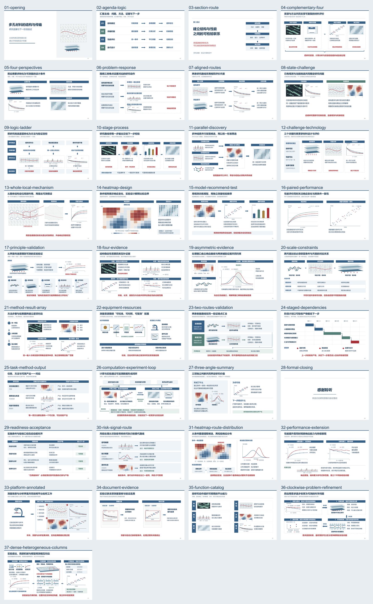

| 编号 | 关系与任务 | 完整参考页 |
|---|---|---|
| 01 | 入口与导航 · 单一研究主题的简洁开场 | [多孔材料的结构与传输](#参考-01) |
| 02 | 入口与导航 · 多部分报告的导航与内在逻辑 | [汇报主线：问题、方法、证据与下一步](#参考-02) |
| 03 | 入口与导航 · 章节标题与最简核心路线 | [建立结构与性能之间的可检验联系](#参考-03) |
| 04 | 总览与关系 · 说明互补模块如何共同贡献 | [资源与方法共同支撑可重复的材料评价](#参考-04) |
| 05 | 总览与关系 · 同一问题的四个互补观察角度 | [把应用要求转化为可测量的设计条件](#参考-05) |
| 06 | 问题与路线 · 问题与解决动作一一对应 | [围绕三类难点设置对应的研究动作](#参考-06) |
| 07 | 问题与路线 · 让两条路线在同维度下可比较 | [两条研究路线采用相同评价尺度](#参考-07) |
| 08 | 总览与关系 · 上部图证据与下部解释成对呈现 | [已有观测与当前挑战共同限定研究问题](#参考-08) |
| 09 | 问题与路线 · 挑战—问题—方法—目标逐层映射 | [把研究挑战逐层转化为方法与验证目标](#参考-09) |
| 10 | 问题与路线 · 信息充实的串行技术总览 | [研究路线将每一步输出交给下一步检验](#参考-10) |
| 11 | 问题与路线 · 多路径汇聚后筛选验证 | [多种线索并行发现候选，再以统一标准筛选](#参考-11) |
| 12 | 问题与路线 · 窄约束区与宽技术图带对应 | [三个关键约束贯穿材料设计与评价](#参考-12) |
| 13 | 机制与证据 · 整体、局部及作用机制之间的观察层级 | [从整体结构定位局部作用，再提出可测假设](#参考-13) |
| 14 | 机制与证据 · 主热图与实验设计并置 | [条件矩阵揭示响应变化，实验设计解释比较边界](#参考-14) |
| 15 | 模型与评价 · 将模型学习与科学验证保持区分 | [用观测训练模型，用独立测量检验推荐](#参考-15) |
| 16 | 模型与评价 · 两个互补证据面板并列 | [性能评价同时关注响应变化与跨条件一致性](#参考-16) |
| 17 | 原理与长流程验证 · 把机制假设转成可核验的实验步骤。 | [从界面传递原理到可测的实验验证](#参考-17) |
| 18 | 四格互补证据 · 围绕同一判断安排不同类型的证据。 | [结构稳定性需要四类互补证据](#参考-18) |
| 19 | 不等宽证据拼图 · 突出决定结论的主图，同时交代筛选与解释依据。 | [处理窗口由主响应曲线与两类辅助证据共同约束](#参考-19) |
| 20 | 跨尺度与多约束图版 · 让不同尺度的图件在共同条件下可解释、可比较。 | [跨尺度比较必须保留条件与尺度的对应关系](#参考-20) |
| 21 | 侧边方法与结果图阵 · 把纵向实施步骤映射到横向证据集合。 | [方法步骤与结果图阵建立逐项对应](#参考-21) |
| 22 | 设备链路与资源用途 · 用原创仪器示意说明设备能回答什么、如何校准。 | [测量资源围绕“可校准、可对照、可复测”配置](#参考-22) |
| 23 | 两路线对照与共享验证 · 比较不同实施路线，并让它们在统一评价端点汇合。 | [两条制备路线在同一验证端点汇合](#参考-23) |
| 24 | 阶段甘特与依赖里程碑 · 显示任务阶段、前置依赖和可验收出口。 | [阶段计划以可验收产物驱动下一步](#参考-24) |
| 25 | 任务方法产出矩阵 · 检查任务与测量端点是否完整匹配。 | [任务、方法与可测产出一一对应](#参考-25) |
| 26 | 双域闭环架构 · 呈现多输入、计算实验协作和可追溯反馈。 | [计算与实验通过可追溯数据形成闭环](#参考-26) |
| 27 | 三角度独立总结 · 分别概括产出、可信依据和下一步问题。 | [三项独立判断共同界定研究价值](#参考-27) |
| 28 | 研究主线与正式结束 · 通过科学对象、核心问题和验证路线收束报告并邀请讨论。 | [感谢聆听](#参考-28) |
| 29 | 实施条件与验收表 · 在同一页明确前提、依据、产物和阶段出口。 | [实施条件与验收口径在启动前对齐](#参考-29) |
| 30 | 风险识别与替代路线 · 把失败情形转成带触发条件的实施分支。 | [风险处理从识别信号转向可执行的替代路线](#参考-30) |
| 31 | 主热图路线与分布异构拼版 · 把高维筛选、候选提取与分布验证连成可读推理。 | [从条件图谱提取候选，再检验响应分布](#参考-31) |
| 32 | 双主证据与底部拓展证据 · 并列比较两项核心性能，并用次级证据说明适用边界。 | [性能提升需同时观察响应能力与持续表现](#参考-32) |
| 33 | 资源与实施 · 场景和带标注平台主图的对应 | [测量场景与分析界面共同说明平台如何工作](#参考-33) |
| 34 | 资源与实施 · 文件或记录图像与相邻判断结合 | [实验记录支撑测量复核与验证追溯](#参考-34) |
| 35 | 资源与实施 · 两列三行功能目录，窄标签与图文结合 | [按研究动作组织可调用的平台能力](#参考-35) |
| 36 | 顺时针四象限问题收束 · 把背景需求逐步推进为对象、子系统机制及可测科学问题。 | [把应用需求逐步收束为可测的科学问题](#参考-36) |
| 37 | 高密度三栏内部异构 · 以三种不同内部构图连接实验、局部机制和模型验证。 | [实验读出、局部机制与模型预测相互对应](#参考-37) |

## 阅读与迁移边界

- **看丰富度**：观察主图、辅助证据、方法信息与结论怎样组合；不要用同一图标反复替代具体科学图件。
- **看变形能力**：图需要放大时让出面积，同一问题的互补结果优先同页整合；素材不足时合并精简页面，不保留大面积空白或空框。标题、框线、状态、结论带和结束页均按需要取舍。
- **看真实素材**：用于实际任务时替换为授权原图、数据图或科学示意，并按图件与证据指南记录来源；合成图不进入真实结果叙事。
- **看整体而不照抄**：图册采用白底、深蓝主色、黑白文字和深红结论。布局可组合变化，不能以参考为由放宽主入口的强制字体、配色和内容密度规则。

每页有独立布局JSON、PPT导出PNG及SVG源图。可编辑PPT是主参考，JSON用于精确读取元素，PNG用于查看实际导出效果。不同演示软件的字体替代仍需在目标环境检查。完整选择信息也保存在 `assets/reference-library/catalog.json`（从技能根目录解析）。

## 参考 01

**多孔材料的结构与传输**

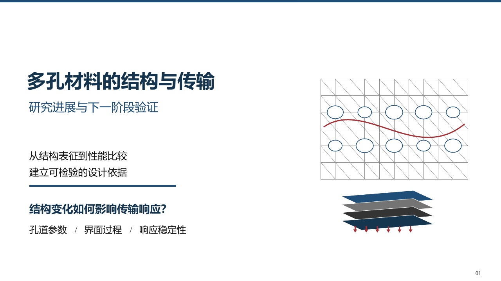

[查看PPT第1页](../assets/reference-library/科研汇报布局参考.pptx) · [布局JSON](../assets/reference-library/layouts/01-opening.json) · [导出PNG](../assets/reference-library/previews/01-opening.png) · [SVG源图](../assets/reference-library/pages/01-opening.svg)

- **用途**：单一研究主题的简洁开场
- **阅读顺序**：先读主题，再由科学对象图建立领域印象
- **可变化**：标题长时转为上下排布；用科学对象与核心问题支撑封面，避免大片无功能留白
- **注意**：不把封面扩展为摘要页

## 参考 02

**汇报主线：问题、方法、证据与下一步**

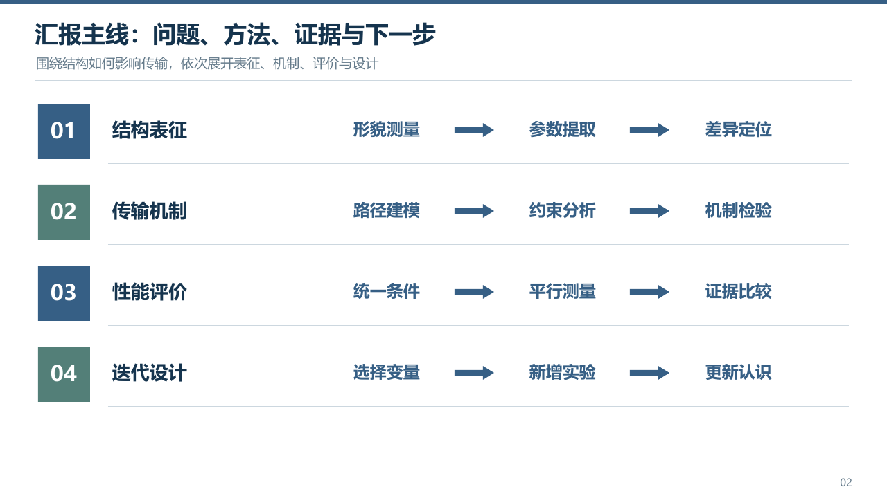

[查看PPT第2页](../assets/reference-library/科研汇报布局参考.pptx) · [布局JSON](../assets/reference-library/layouts/02-agenda-logic.json) · [导出PNG](../assets/reference-library/previews/02-agenda-logic.png) · [SVG源图](../assets/reference-library/pages/02-agenda-logic.svg)

- **用途**：多部分报告的导航与内在逻辑
- **阅读顺序**：按章节纵向阅读，每行再从左到右读取短路线
- **可变化**：短报告可省略独立目录；各行可改为问题—证据—结论
- **注意**：箭头按可见词组间隙居中，不按文本框边界盲对齐

## 参考 03

**建立结构与性能之间的可检验联系**

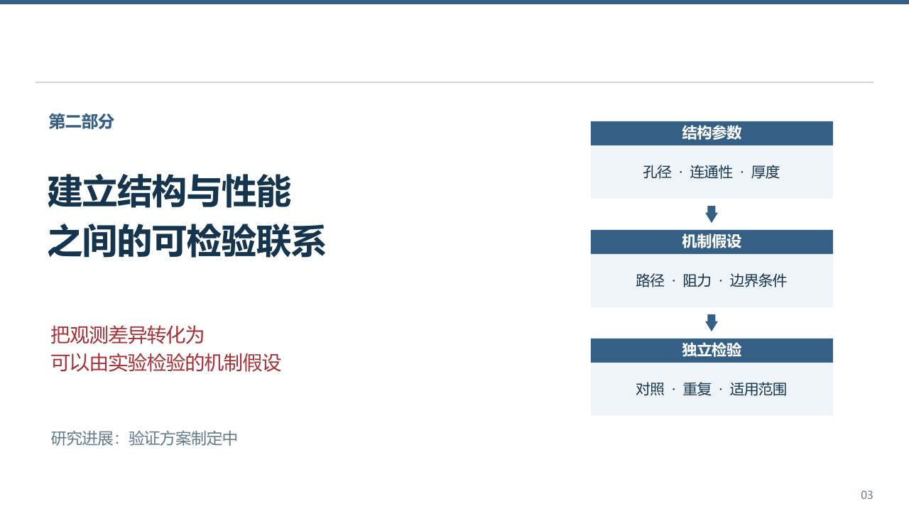

[查看PPT第3页](../assets/reference-library/科研汇报布局参考.pptx) · [布局JSON](../assets/reference-library/layouts/03-section-route.json) · [导出PNG](../assets/reference-library/previews/03-section-route.png) · [SVG源图](../assets/reference-library/pages/03-section-route.svg)

- **用途**：章节标题与最简核心路线
- **阅读顺序**：左侧主题→右侧路线→左下进展
- **可变化**：进展标签按需删除；步骤按真实问题调整数量或改为水平排布
- **注意**：状态不能挤在主标题与重点概括之间；章节标题不能被右侧流程压弱

## 参考 04

**资源与方法共同支撑可重复的材料评价**

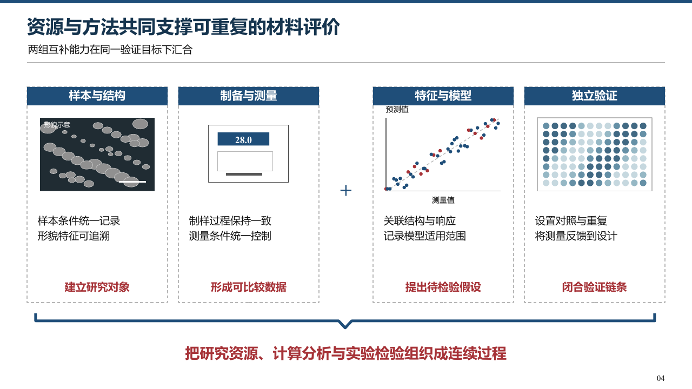

[查看PPT第4页](../assets/reference-library/科研汇报布局参考.pptx) · [布局JSON](../assets/reference-library/layouts/04-complementary-four.json) · [导出PNG](../assets/reference-library/previews/04-complementary-four.png) · [SVG源图](../assets/reference-library/pages/04-complementary-four.svg)

- **用途**：说明互补模块如何共同贡献
- **阅读顺序**：读两组模块→跨四块括号→共同目标
- **可变化**：可改为3栏或非等宽区域；加号只在确有合并贡献时保留
- **注意**：括号须覆盖全部参与模块；长方形图片区应利用有效宽度

## 参考 05

**把应用要求转化为可测量的设计条件**

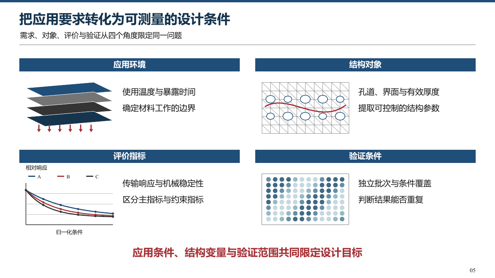

[查看PPT第5页](../assets/reference-library/科研汇报布局参考.pptx) · [布局JSON](../assets/reference-library/layouts/05-four-perspectives.json) · [导出PNG](../assets/reference-library/previews/05-four-perspectives.png) · [SVG源图](../assets/reference-library/pages/05-four-perspectives.svg)

- **用途**：同一问题的四个互补观察角度
- **阅读顺序**：按阅读顺序看四块，再由共同指标串联
- **可变化**：适合背景、问题拆解或研究要素；可改为三块，不强行画递进箭头
- **注意**：并列角度不能伪画成必然先后

## 参考 06

**围绕三类难点设置对应的研究动作**

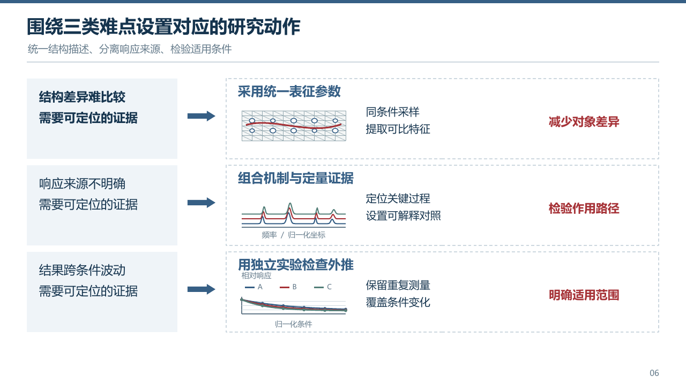

[查看PPT第6页](../assets/reference-library/科研汇报布局参考.pptx) · [布局JSON](../assets/reference-library/layouts/06-problem-response.json) · [导出PNG](../assets/reference-library/previews/06-problem-response.png) · [SVG源图](../assets/reference-library/pages/06-problem-response.svg)

- **用途**：问题与解决动作一一对应
- **阅读顺序**：逐行从左侧难点走向方法、证据和目标
- **可变化**：问题超过3条时按主次拆页；可用于风险应对而非一律三行
- **注意**：右侧不能只有方法名，要说明输入与作用

## 参考 07

**两条研究路线采用相同评价尺度**

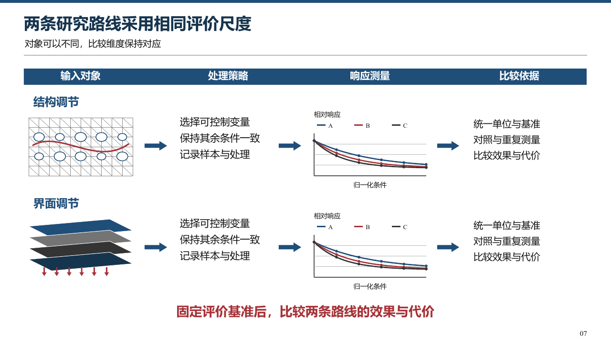

[查看PPT第7页](../assets/reference-library/科研汇报布局参考.pptx) · [布局JSON](../assets/reference-library/layouts/07-aligned-routes.json) · [导出PNG](../assets/reference-library/previews/07-aligned-routes.png) · [SVG源图](../assets/reference-library/pages/07-aligned-routes.svg)

- **用途**：让两条路线在同维度下可比较
- **阅读顺序**：先看列维度，再横向读每条路线
- **可变化**：可以是方法前后或两套平台；小图可换成真实结构与数据
- **注意**：两行采用不同指标时必须交代不可直接比较的部分

## 参考 08

**已有观测与当前挑战共同限定研究问题**

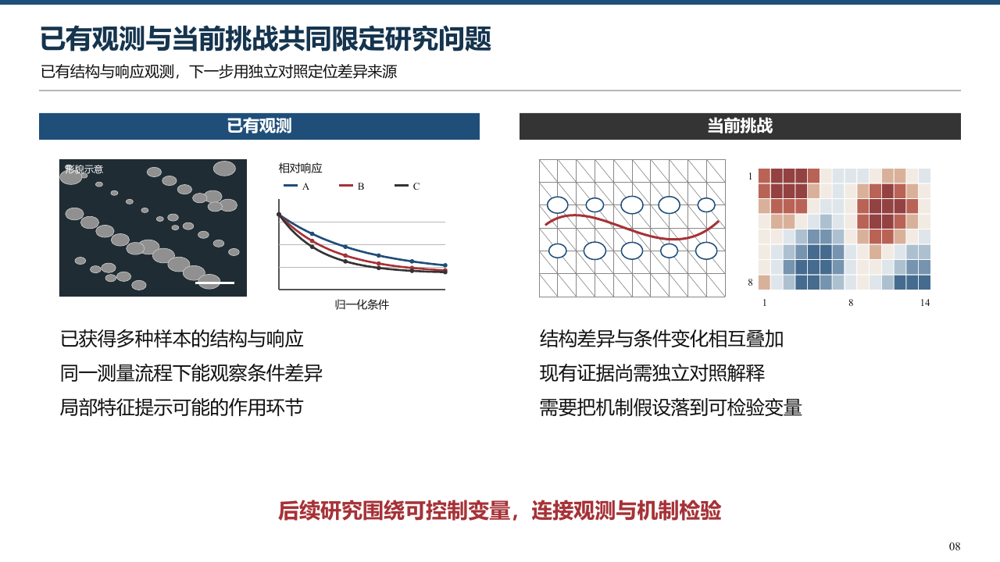

[查看PPT第8页](../assets/reference-library/科研汇报布局参考.pptx) · [布局JSON](../assets/reference-library/layouts/08-state-challenge.json) · [导出PNG](../assets/reference-library/previews/08-state-challenge.png) · [SVG源图](../assets/reference-library/pages/08-state-challenge.svg)

- **用途**：上部图证据与下部解释成对呈现
- **阅读顺序**：左侧已有材料→右侧未解决问题→研究切入点
- **可变化**：可替换为需求与现状、理论与应用；每列可用大图或两张相关小图
- **注意**：不是把外部文献结果当作本研究成绩

## 参考 09

**把研究挑战逐层转化为方法与验证目标**

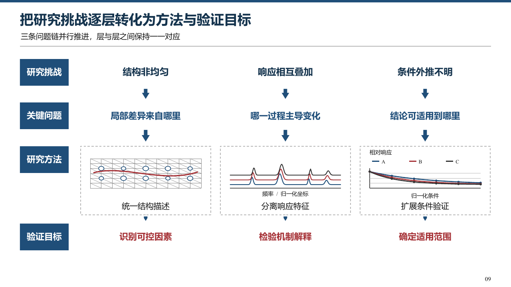

[查看PPT第9页](../assets/reference-library/科研汇报布局参考.pptx) · [布局JSON](../assets/reference-library/layouts/09-logic-ladder.json) · [导出PNG](../assets/reference-library/previews/09-logic-ladder.png) · [SVG源图](../assets/reference-library/pages/09-logic-ladder.svg)

- **用途**：挑战—问题—方法—目标逐层映射
- **阅读顺序**：先看行层级，再沿三条纵向链阅读
- **可变化**：列数随问题数量变化；方法层可换成图证据或技术组合
- **注意**：每一层必须产生新信息，避免同义重述

## 参考 10

**研究路线将每一步输出交给下一步检验**

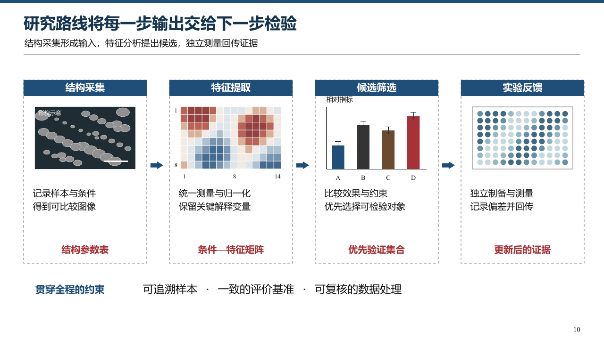

[查看PPT第10页](../assets/reference-library/科研汇报布局参考.pptx) · [布局JSON](../assets/reference-library/layouts/10-stage-process.json) · [导出PNG](../assets/reference-library/previews/10-stage-process.png) · [SVG源图](../assets/reference-library/pages/10-stage-process.svg)

- **用途**：信息充实的串行技术总览
- **阅读顺序**：沿粗箭头读取输入到反馈，每段读图再读操作与输出
- **可变化**：可改3或5段，也可上下两层；方法参数放在有关节点，非另列缩写墙
- **注意**：没有先后关系的算法不能为排版而串联

## 参考 11

**多种线索并行发现候选，再以统一标准筛选**

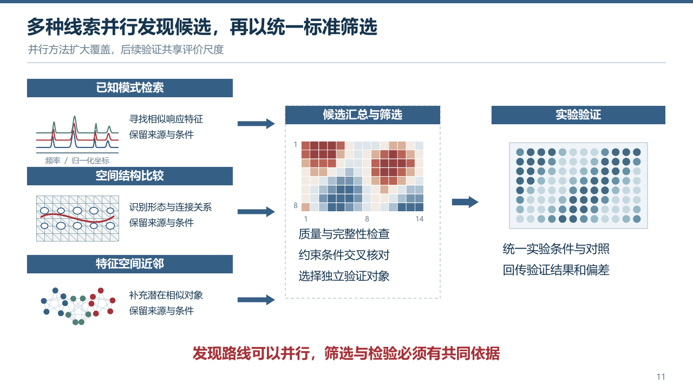

[查看PPT第11页](../assets/reference-library/科研汇报布局参考.pptx) · [布局JSON](../assets/reference-library/layouts/11-parallel-discovery.json) · [导出PNG](../assets/reference-library/previews/11-parallel-discovery.png) · [SVG源图](../assets/reference-library/pages/11-parallel-discovery.svg)

- **用途**：多路径汇聚后筛选验证
- **阅读顺序**：三个输入通道→候选集合→共同筛选→实验
- **可变化**：通道可换成不同数据或算法；筛选可拆成独立页深入说明
- **注意**：模型相似性不是功能验证结果

## 参考 12

**三个关键约束贯穿材料设计与评价**

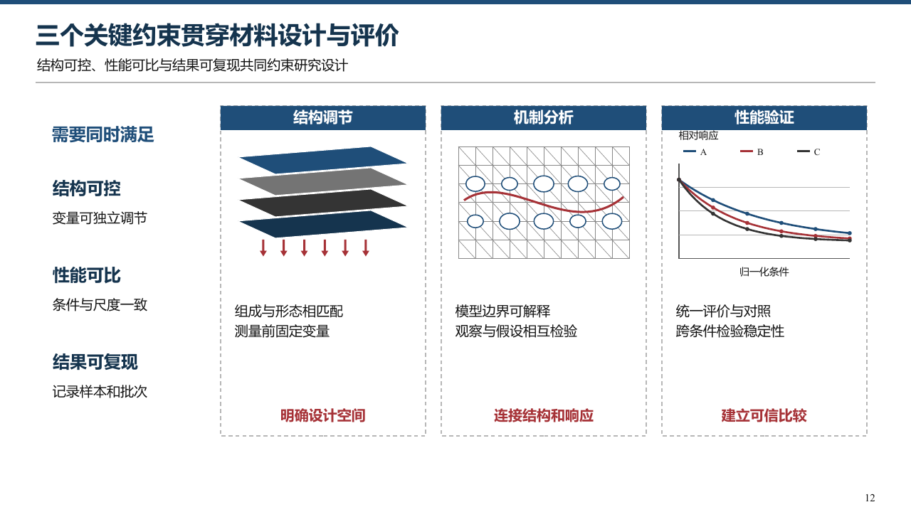

[查看PPT第12页](../assets/reference-library/科研汇报布局参考.pptx) · [布局JSON](../assets/reference-library/layouts/12-challenge-technology.json) · [导出PNG](../assets/reference-library/previews/12-challenge-technology.png) · [SVG源图](../assets/reference-library/pages/12-challenge-technology.svg)

- **用途**：窄约束区与宽技术图带对应
- **阅读顺序**：左侧约束为阅读透镜，横向看三项技术措施
- **可变化**：可换成材料需求或临床/工程约束；技术栏根据图大小采用非等宽
- **注意**：不要把难点栏与右侧内容做成无关清单

## 参考 13

**从整体结构定位局部作用，再提出可测假设**

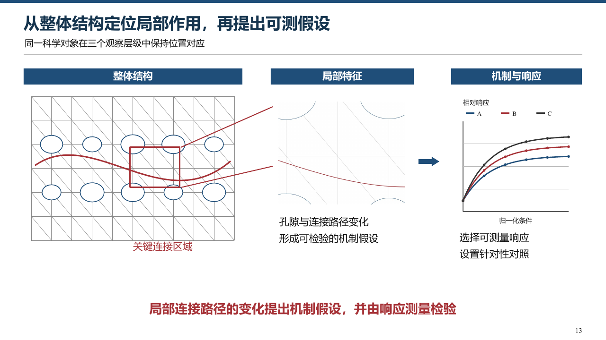

[查看PPT第13页](../assets/reference-library/科研汇报布局参考.pptx) · [布局JSON](../assets/reference-library/layouts/13-whole-local-mechanism.json) · [导出PNG](../assets/reference-library/previews/13-whole-local-mechanism.png) · [SVG源图](../assets/reference-library/pages/13-whole-local-mechanism.svg)

- **用途**：整体、局部及作用机制之间的观察层级
- **阅读顺序**：整体定位→局部放大→机制与读出
- **可变化**：局部可有多个窗口；机制层可换成残基互作、材料界面或细胞区域
- **注意**：放大图需要位置与尺度关联，不能任意拼一张近景

## 参考 14

**条件矩阵揭示响应变化，实验设计解释比较边界**

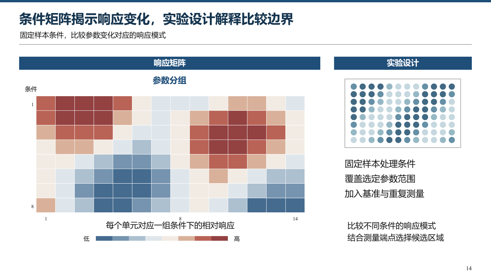

[查看PPT第14页](../assets/reference-library/科研汇报布局参考.pptx) · [布局JSON](../assets/reference-library/layouts/14-heatmap-design.json) · [导出PNG](../assets/reference-library/previews/14-heatmap-design.png) · [SVG源图](../assets/reference-library/pages/14-heatmap-design.svg)

- **用途**：主热图与实验设计并置
- **阅读顺序**：先理解侧栏条件，再按主图坐标比较模式
- **可变化**：主图可为矩阵、关联图或图谱；侧栏可换设计图、样本分组或统计依据
- **注意**：保留行列、颜色含义及归一化基准

## 参考 15

**用观测训练模型，用独立测量检验推荐**

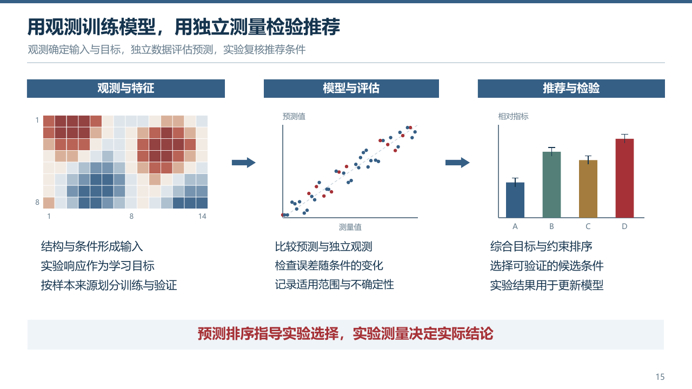

[查看PPT第15页](../assets/reference-library/科研汇报布局参考.pptx) · [布局JSON](../assets/reference-library/layouts/15-model-recommend-test.json) · [导出PNG](../assets/reference-library/previews/15-model-recommend-test.png) · [SVG源图](../assets/reference-library/pages/15-model-recommend-test.svg)

- **用途**：将模型学习与科学验证保持区分
- **阅读顺序**：观测→训练/评估→推荐/检验
- **可变化**：复杂网络结构可放附录；数据少时把模型节点标为计划而非训练完成
- **注意**：不能把内部模型分数直接写成真实实验性能

## 参考 16

**性能评价同时关注响应变化与跨条件一致性**

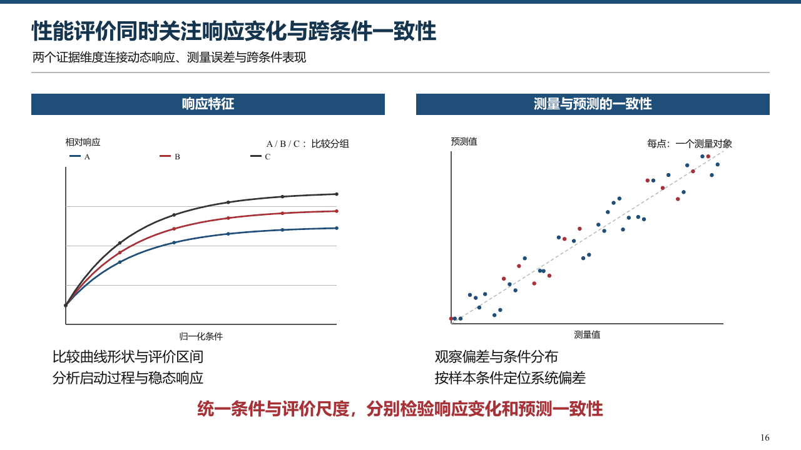

[查看PPT第16页](../assets/reference-library/科研汇报布局参考.pptx) · [布局JSON](../assets/reference-library/layouts/16-paired-performance.json) · [导出PNG](../assets/reference-library/previews/16-paired-performance.png) · [SVG源图](../assets/reference-library/pages/16-paired-performance.svg)

- **用途**：两个互补证据面板并列
- **阅读顺序**：先看指标定义，再比较趋势与偏差
- **可变化**：可用于速度/精度、活性/稳定性等维度；两图可不等宽，按证据复杂度分配
- **注意**：同页比较应保留单位、条件和必要对照

## 参考 17

**从界面传递原理到可测的实验验证**

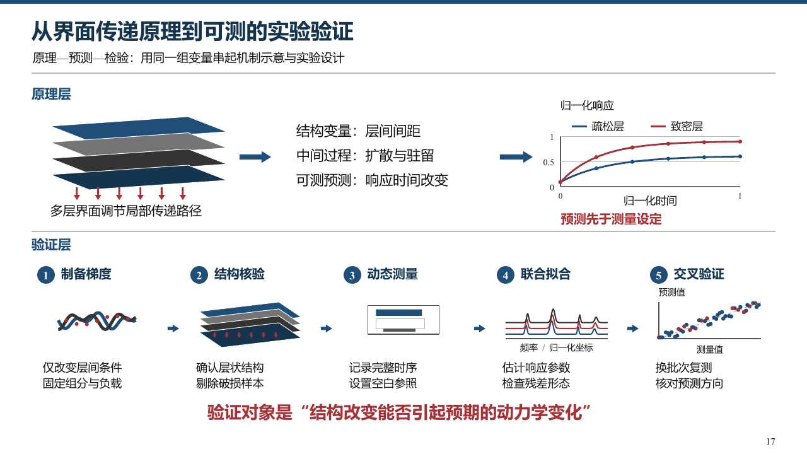

[查看PPT第17页](../assets/reference-library/科研汇报布局参考.pptx) · [布局JSON](../assets/reference-library/layouts/17-principle-validation.json) · [导出PNG](../assets/reference-library/previews/17-principle-validation.png) · [SVG源图](../assets/reference-library/pages/17-principle-validation.svg)

- **用途**：把机制假设转成可核验的实验步骤。
- **阅读顺序**：先读上方原理与预测，再沿下方流程核对每一步产物。
- **可变化**：原理层保留一个可测预测；实验层可扩展为四至六步，并标明控制变量
- **注意**：不要用无科学含义的图标代替步骤内容

## 参考 18

**结构稳定性需要四类互补证据**

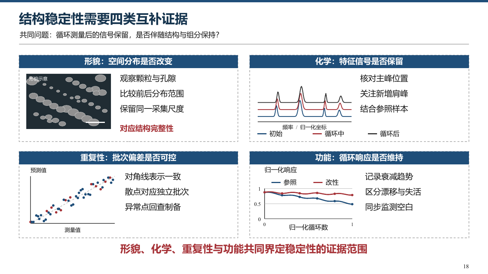

[查看PPT第18页](../assets/reference-library/科研汇报布局参考.pptx) · [布局JSON](../assets/reference-library/layouts/18-four-evidence.json) · [导出PNG](../assets/reference-library/previews/18-four-evidence.png) · [SVG源图](../assets/reference-library/pages/18-four-evidence.svg)

- **用途**：围绕同一判断安排不同类型的证据。
- **阅读顺序**：左上形貌、右上化学、左下重复性、右下功能，再归纳证据交集。
- **可变化**：每格回答同一主问题的不同子问题；优先使用不同图种，减少重复信息
- **注意**：不要把四个互不相关的结果硬拼成一页

## 参考 19

**处理窗口由主响应曲线与两类辅助证据共同约束**

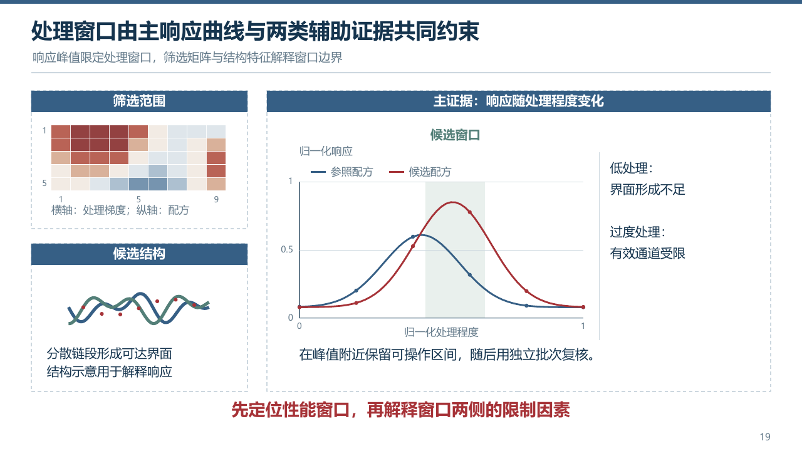

[查看PPT第19页](../assets/reference-library/科研汇报布局参考.pptx) · [布局JSON](../assets/reference-library/layouts/19-asymmetric-evidence.json) · [导出PNG](../assets/reference-library/previews/19-asymmetric-evidence.png) · [SVG源图](../assets/reference-library/pages/19-asymmetric-evidence.svg)

- **用途**：突出决定结论的主图，同时交代筛选与解释依据。
- **阅读顺序**：左侧筛选和结构提供背景，右侧主曲线确定条件窗口。
- **可变化**：主图面积随证据权重增加；辅助图只保留解释主图所需的信息
- **注意**：不要把弱证据放大成视觉中心

## 参考 20

**跨尺度比较必须保留条件与尺度的对应关系**

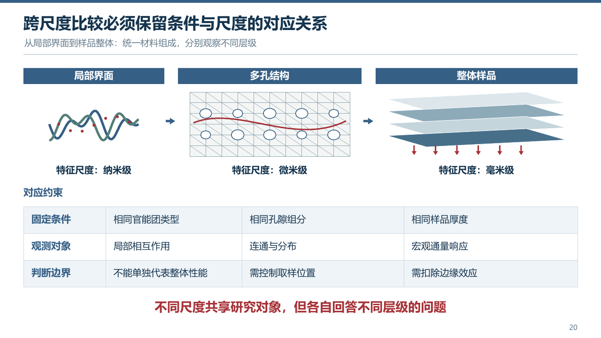

[查看PPT第20页](../assets/reference-library/科研汇报布局参考.pptx) · [布局JSON](../assets/reference-library/layouts/20-scale-constraints.json) · [导出PNG](../assets/reference-library/previews/20-scale-constraints.png) · [SVG源图](../assets/reference-library/pages/20-scale-constraints.svg)

- **用途**：让不同尺度的图件在共同条件下可解释、可比较。
- **阅读顺序**：上方从局部读到整体，再逐行核对固定条件、观测对象和判断边界。
- **可变化**：在图旁保留尺度身份；表格逐项对齐各尺度的条件与输出
- **注意**：不要用放大倍数替代物理尺度；不要从局部图直接推断整体性能

## 参考 21

**方法步骤与结果图阵建立逐项对应**

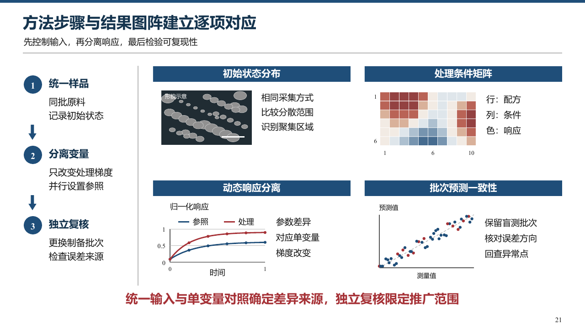

[查看PPT第21页](../assets/reference-library/科研汇报布局参考.pptx) · [布局JSON](../assets/reference-library/layouts/21-method-result-array.json) · [导出PNG](../assets/reference-library/previews/21-method-result-array.png) · [SVG源图](../assets/reference-library/pages/21-method-result-array.svg)

- **用途**：把纵向实施步骤映射到横向证据集合。
- **阅读顺序**：左侧按步骤读方法，右侧由上到下读输入核验、变量效应与复核结果。
- **可变化**：侧栏只放决定证据解释的方法；图阵中的条件名称与方法保持一致
- **注意**：不要让方法侧栏挤压证据图到不可读

## 参考 22

**测量资源围绕“可校准、可对照、可复测”配置**

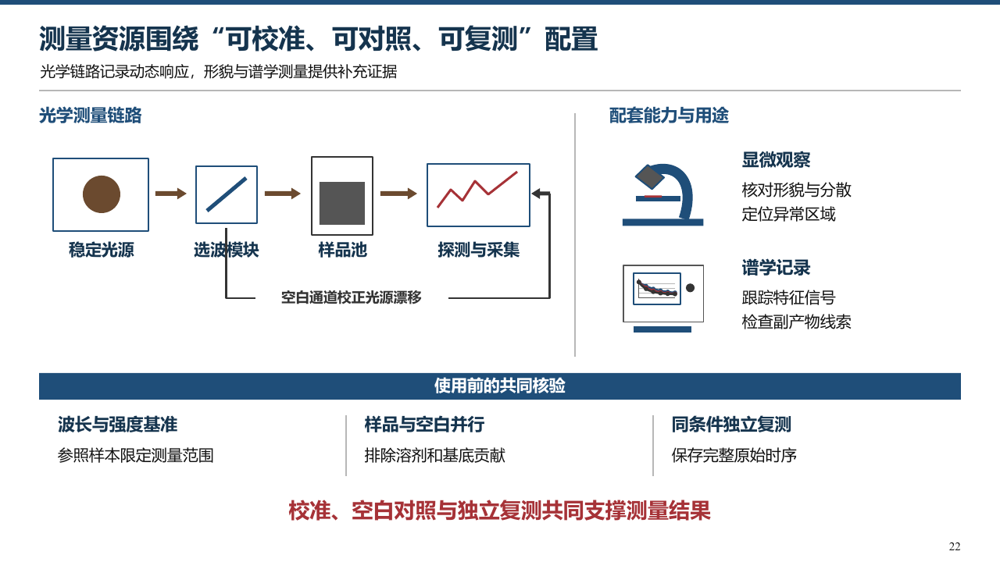

[查看PPT第22页](../assets/reference-library/科研汇报布局参考.pptx) · [布局JSON](../assets/reference-library/layouts/22-equipment-resources.json) · [导出PNG](../assets/reference-library/previews/22-equipment-resources.png) · [SVG源图](../assets/reference-library/pages/22-equipment-resources.svg)

- **用途**：用原创仪器示意说明设备能回答什么、如何校准。
- **阅读顺序**：先沿光路读主测量链路，再看右侧补充能力与底部共同核验。
- **可变化**：设备对应具体可测对象；链路中标清样品、参照与信号出口
- **注意**：不要把设备照片墙当成实施能力证明

## 参考 23

**两条制备路线在同一验证端点汇合**

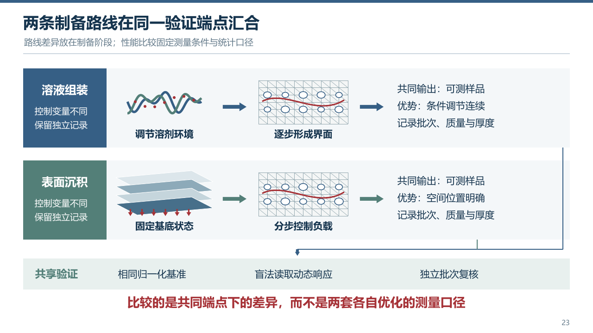

[查看PPT第23页](../assets/reference-library/科研汇报布局参考.pptx) · [布局JSON](../assets/reference-library/layouts/23-two-routes-validation.json) · [导出PNG](../assets/reference-library/previews/23-two-routes-validation.png) · [SVG源图](../assets/reference-library/pages/23-two-routes-validation.svg)

- **用途**：比较不同实施路线，并让它们在统一评价端点汇合。
- **阅读顺序**：先分别读两条路线的操作差异，再读底部共享验证约束。
- **可变化**：两路线共用节点位置便于逐项比较；把固定测量口径作为实际汇合点
- **注意**：不要用不同条件下的最好结果直接排名

## 参考 24

**阶段计划以可验收产物驱动下一步**

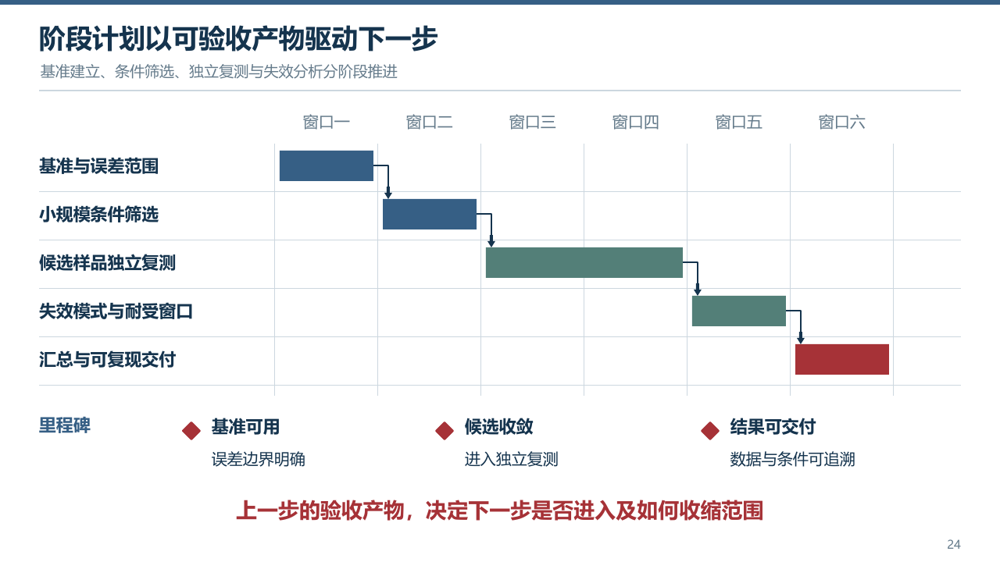

[查看PPT第24页](../assets/reference-library/科研汇报布局参考.pptx) · [布局JSON](../assets/reference-library/layouts/24-staged-dependencies.json) · [导出PNG](../assets/reference-library/previews/24-staged-dependencies.png) · [SVG源图](../assets/reference-library/pages/24-staged-dependencies.svg)

- **用途**：显示任务阶段、前置依赖和可验收出口。
- **阅读顺序**：先读任务行及窗口范围，再沿依赖箭头核对底部里程碑。
- **可变化**：横轴使用实际日期或明确的阶段窗口；并行或重叠任务可另行安排，标清依赖何时满足
- **注意**：不要把孤立时间条当成项目逻辑

## 参考 25

**任务、方法与可测产出一一对应**

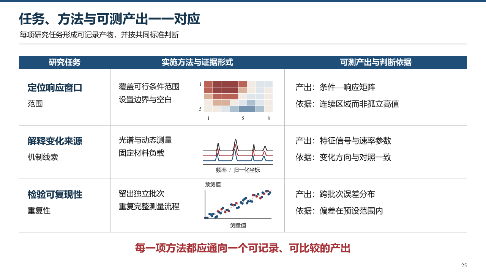

[查看PPT第25页](../assets/reference-library/科研汇报布局参考.pptx) · [布局JSON](../assets/reference-library/layouts/25-task-method-output.json) · [导出PNG](../assets/reference-library/previews/25-task-method-output.png) · [SVG源图](../assets/reference-library/pages/25-task-method-output.svg)

- **用途**：检查任务与测量端点是否完整匹配。
- **阅读顺序**：按行读任务、方法和产出，再纵向比较证据覆盖范围。
- **可变化**：在方法列嵌入少量对应科学图形；产出写明测量量和判断依据
- **注意**：不要把方法名称列表当成技术路线

## 参考 26

**计算与实验通过可追溯数据形成闭环**

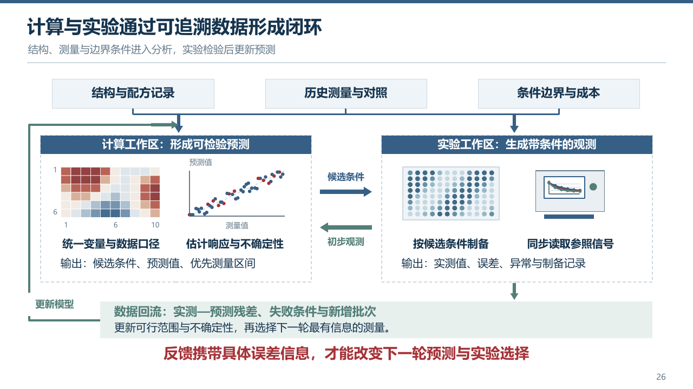

[查看PPT第26页](../assets/reference-library/科研汇报布局参考.pptx) · [布局JSON](../assets/reference-library/layouts/26-computation-experiment-loop.json) · [导出PNG](../assets/reference-library/previews/26-computation-experiment-loop.png) · [SVG源图](../assets/reference-library/pages/26-computation-experiment-loop.svg)

- **用途**：呈现多输入、计算实验协作和可追溯反馈。
- **阅读顺序**：顶部汇总输入，中部从计算读到实验，底部沿回流路径返回模型更新。
- **可变化**：标明跨域交换的信息内容；反馈写清更新对象及触发下一轮的依据
- **注意**：不要只画循环箭头而不说明回流数据

## 参考 27

**三项独立判断共同界定研究价值**

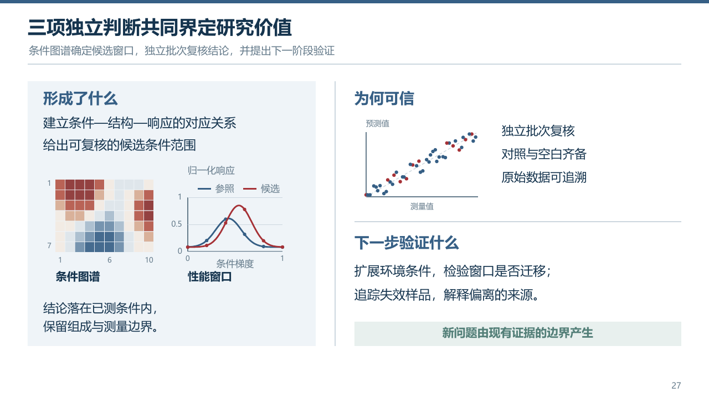

[查看PPT第27页](../assets/reference-library/科研汇报布局参考.pptx) · [布局JSON](../assets/reference-library/layouts/27-three-angle-summary.json) · [导出PNG](../assets/reference-library/previews/27-three-angle-summary.png) · [SVG源图](../assets/reference-library/pages/27-three-angle-summary.svg)

- **用途**：分别概括产出、可信依据和下一步问题。
- **阅读顺序**：左侧归纳结果，右上回看可信依据，右下收束下一步验证。
- **可变化**：用少量证据缩图唤起前文；下一步对应当前证据边界
- **注意**：不要把总结页写成三栏纯文字口号

## 参考 28

**感谢聆听**

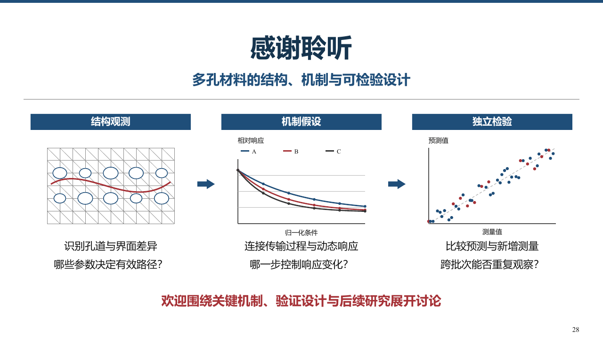

[查看PPT第28页](../assets/reference-library/科研汇报布局参考.pptx) · [布局JSON](../assets/reference-library/layouts/28-formal-closing.json) · [导出PNG](../assets/reference-library/previews/28-formal-closing.png) · [SVG源图](../assets/reference-library/pages/28-formal-closing.svg)

- **用途**：通过科学对象、核心问题和验证路线收束报告并邀请讨论。
- **阅读顺序**：先读致谢与研究主题，再沿三步主线回顾研究，最后进入讨论。
- **可变化**：用已讲过的对象与主线收束，不在结束页引入新结果；可按用途替换讨论问题；不需要独立结束页时可省略
- **注意**：不保留大片无功能留白，也不为填满版面加入无关图表

## 参考 29

**实施条件与验收口径在启动前对齐**

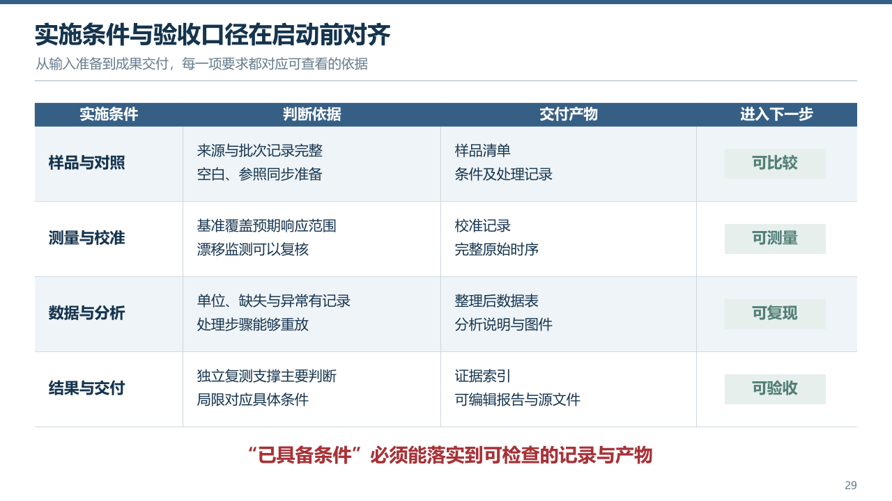

[查看PPT第29页](../assets/reference-library/科研汇报布局参考.pptx) · [布局JSON](../assets/reference-library/layouts/29-readiness-acceptance.json) · [导出PNG](../assets/reference-library/previews/29-readiness-acceptance.png) · [SVG源图](../assets/reference-library/pages/29-readiness-acceptance.svg)

- **用途**：在同一页明确前提、依据、产物和阶段出口。
- **阅读顺序**：按行核对实施条件及其证据，再确认最后一列的进入资格。
- **可变化**：判断依据写成可观察的状态；交付列列出实际文件或记录
- **注意**：不要只写资源充足、条件成熟等概括语

## 参考 30

**风险处理从识别信号转向可执行的替代路线**

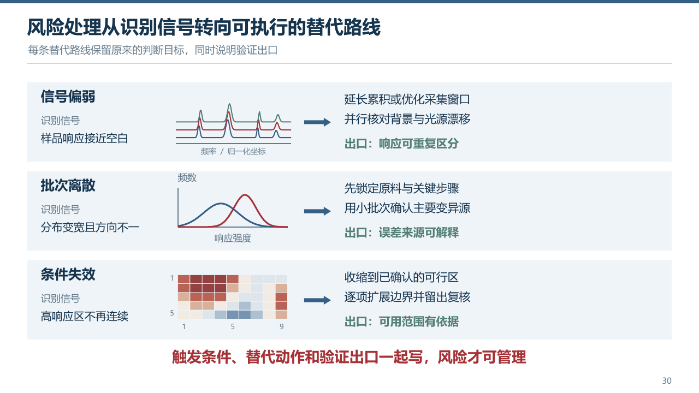

[查看PPT第30页](../assets/reference-library/科研汇报布局参考.pptx) · [布局JSON](../assets/reference-library/layouts/30-risk-signal-route.json) · [导出PNG](../assets/reference-library/previews/30-risk-signal-route.png) · [SVG源图](../assets/reference-library/pages/30-risk-signal-route.svg)

- **用途**：把失败情形转成带触发条件的实施分支。
- **阅读顺序**：每行从风险和信号图读向替代动作，最后检查验证出口。
- **可变化**：识别信号使用实际可测现象；替代路线保留研究目标并明确验证方式
- **注意**：不要堆叠没有触发条件的警告

## 参考 31

**从条件图谱提取候选，再检验响应分布**

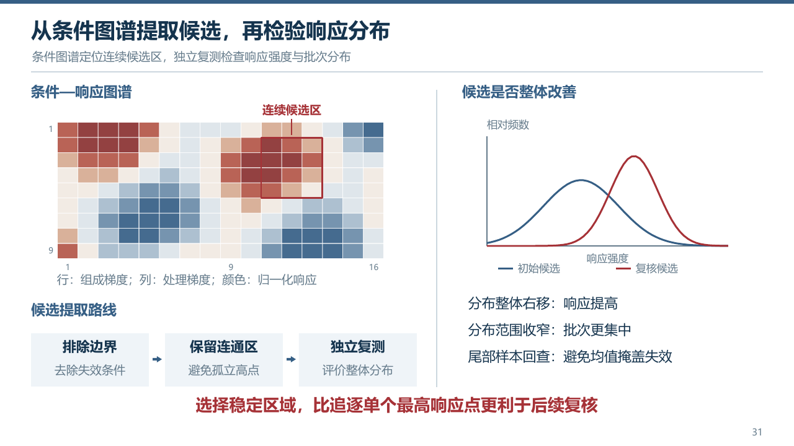

[查看PPT第31页](../assets/reference-library/科研汇报布局参考.pptx) · [布局JSON](../assets/reference-library/layouts/31-heatmap-route-distribution.json) · [导出PNG](../assets/reference-library/previews/31-heatmap-route-distribution.png) · [SVG源图](../assets/reference-library/pages/31-heatmap-route-distribution.svg)

- **用途**：把高维筛选、候选提取与分布验证连成可读推理。
- **阅读顺序**：左上读候选区域，左下读提取规则，右侧读独立复核的整体分布。
- **可变化**：用边框明确候选区在热图中的位置；分布图应检验候选集合而非孤立最优值
- **注意**：不要用均值单独代表离散候选的表现

## 参考 32

**性能提升需同时观察响应能力与持续表现**

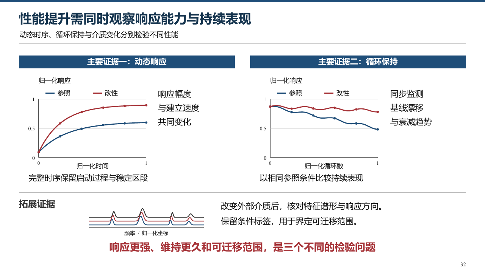

[查看PPT第32页](../assets/reference-library/科研汇报布局参考.pptx) · [布局JSON](../assets/reference-library/layouts/32-performance-extension.json) · [导出PNG](../assets/reference-library/previews/32-performance-extension.png) · [SVG源图](../assets/reference-library/pages/32-performance-extension.svg)

- **用途**：并列比较两项核心性能，并用次级证据说明适用边界。
- **阅读顺序**：先读左右两块主要性能，再读底部拓展条件及其验证作用。
- **可变化**：主证据共用可比较的图尺度；拓展证据保留独立条件身份
- **注意**：不要把次要拓展结果写成主要性能的替代证明

## 参考 33

**测量场景与分析界面共同说明平台如何工作**

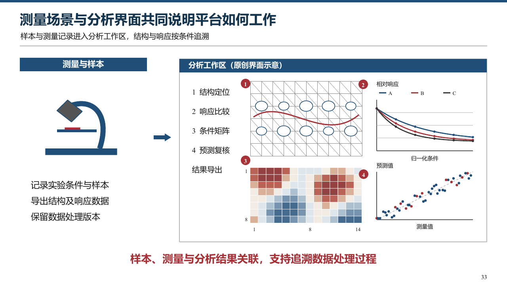

[查看PPT第33页](../assets/reference-library/科研汇报布局参考.pptx) · [布局JSON](../assets/reference-library/layouts/33-platform-annotated.json) · [导出PNG](../assets/reference-library/previews/33-platform-annotated.png) · [SVG源图](../assets/reference-library/pages/33-platform-annotated.svg)

- **用途**：场景和带标注平台主图的对应
- **阅读顺序**：左场景→右界面的编号操作区
- **可变化**：实际项目换成获授权的真实截图；标注编号旁给明确功能，不只画高亮框
- **注意**：不要用臆造界面暗示已有软件功能

## 参考 34

**实验记录支撑测量复核与验证追溯**

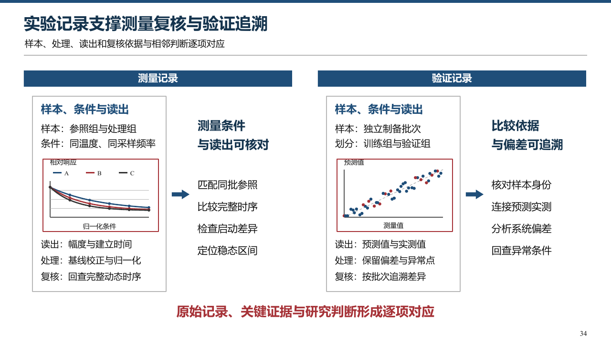

[查看PPT第34页](../assets/reference-library/科研汇报布局参考.pptx) · [布局JSON](../assets/reference-library/layouts/34-document-evidence.json) · [导出PNG](../assets/reference-library/previews/34-document-evidence.png) · [SVG源图](../assets/reference-library/pages/34-document-evidence.svg)

- **用途**：文件或记录图像与相邻判断结合
- **阅读顺序**：看记录类型→定位证据区域→读支持的判断
- **可变化**：可用于审查材料、方法记录、文献证据；证据图难读时裁出关键区域并保留上下文
- **注意**：不要把合成记录当作真实证明材料

## 参考 35

**按研究动作组织可调用的平台能力**

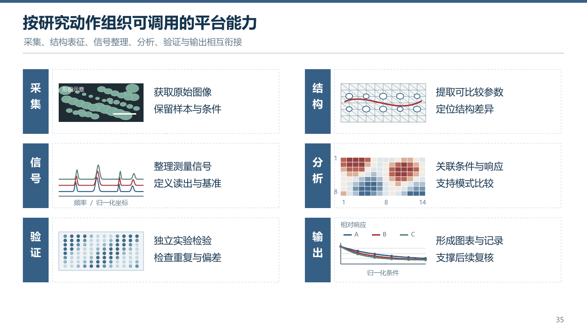

[查看PPT第35页](../assets/reference-library/科研汇报布局参考.pptx) · [布局JSON](../assets/reference-library/layouts/35-function-catalog.json) · [导出PNG](../assets/reference-library/previews/35-function-catalog.png) · [SVG源图](../assets/reference-library/pages/35-function-catalog.svg)

- **用途**：两列三行功能目录，窄标签与图文结合
- **阅读顺序**：先按标签定位功能，再看对象图与用途
- **可变化**：功能少时改一列或2×2；单元尺寸按内容调整，不要求满六项
- **注意**：功能介绍应对应真实可用能力，不能把计划混为现成

## 参考 36

**把应用需求逐步收束为可测的科学问题**

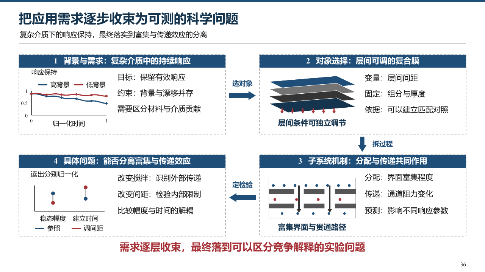

[查看PPT第36页](../assets/reference-library/科研汇报布局参考.pptx) · [布局JSON](../assets/reference-library/layouts/36-clockwise-problem-refinement.json) · [导出PNG](../assets/reference-library/previews/36-clockwise-problem-refinement.png) · [SVG源图](../assets/reference-library/pages/36-clockwise-problem-refinement.svg)

- **用途**：把背景需求逐步推进为对象、子系统机制及可测科学问题。
- **阅读顺序**：从左上背景顺时针读到右上对象、右下机制，最后在左下形成独立检验。
- **可变化**：四个象限承担前后依赖的不同论证任务；终点给出能区分解释的操作变量与读出；存在真实更新关系时再增加注明回流信息的返回路径
- **注意**：不要把顺序四象限改成互不关联的四个视角；不要为了闭合形状添加无信息的回流箭头

## 参考 37

**实验读出、局部机制与模型预测相互对应**

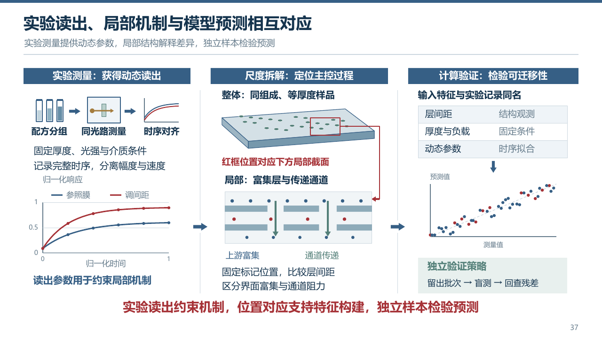

[查看PPT第37页](../assets/reference-library/科研汇报布局参考.pptx) · [布局JSON](../assets/reference-library/layouts/37-dense-heterogeneous-columns.json) · [导出PNG](../assets/reference-library/previews/37-dense-heterogeneous-columns.png) · [SVG源图](../assets/reference-library/pages/37-dense-heterogeneous-columns.svg)

- **用途**：以三种不同内部构图连接实验、局部机制和模型验证。
- **阅读顺序**：左栏由实验小流程读到时序数据，中栏由整体红框读到局部，右栏由输入特征读到预测和独立验证。
- **可变化**：三栏围绕同一研究对象，但分别使用流程、位置放大与特征预测结构；保留整体与局部的位置连线，模型输入与实验记录使用同名变量；跨栏箭头连接证据与解释，栏内图件各自保留必要标签
- **注意**：不要将三栏简化成重复的图标加三行文字；不要让训练内拟合替代独立验证
